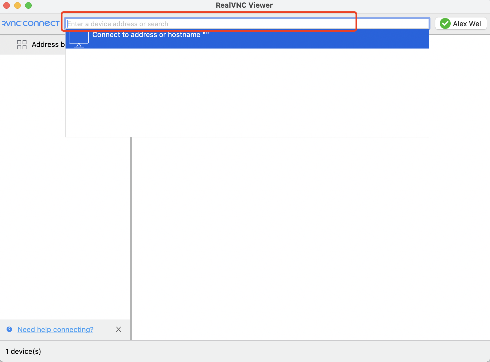
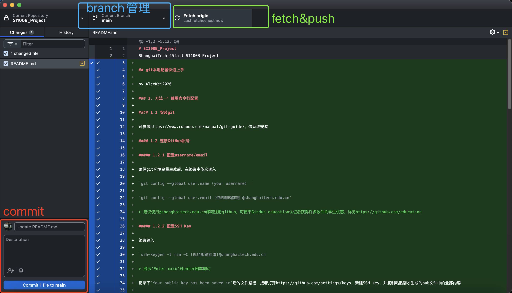
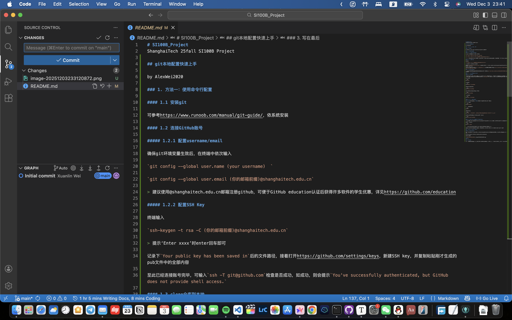

# SI100B_Project
ShanghaiTech 25fall SI100B Project: Handwritten Number Recognization

## Contributors

[@AlexWei2020](https://github.com/AlexWei2020), [@EvelynX2025](https://github.com/EvelynX2025), [@hongyue2025](https://github.com/hongyue2025)

## 任务时间表

| 时间                                         | 内容                                      | 具体要求                                                     |
| -------------------------------------------- | ----------------------------------------- | ------------------------------------------------------------ |
| ✅第1次，Week13，12/10，周三                  | Project介绍，环境搭建                     | 了解Project涉及的内容；安装Project所需工具；<br>检查树莓派及附件完好性；熟悉树莓派同PC的各种连接方式； |
| ✅第2次，Week13，12/12，周五                  | 完成训练集的创建及自测（8+2分）           | 解析数据集图片，获取训练集所需素材；<br>按照kNN算法要求，生成数据集及对应标签（训练数据+测试数据）；<br>生成训练集，检查准确率；将训练集结果保存至文档，以备后用（8分）； |
| ✅第3次，Week14，12/17，周三                  | 单行数字识别（15+5）                      | 待测图片预处理：二值化，分割等；<br>待测数字识别；<br>（识别率：顺序和结果均正确，每个得3分，15分封顶。如有多余部分出现，每个扣2分） |
| 第4次，Week14，12/19，周五                   | 多行数字识别（5+2）<br>识别率提升（15+3） | 多行数字分割及识别（5分。如有多余行，每行扣除2分）；<br>识别率的因素分析，识别精度提升；<br>（单行识别率：顺序及结果均正确，大于5个后，每多识别一个得3分，15分封顶。如有多余部分出现，每个扣2分） |
| 第5次，Week15，12/24，周三                   | 数码管显示电路（5+3）                     | 搭建数码管显示电路；排线正确整齐；<br>使用数码管按要求显示识别后的数字（5分，正确显示结果。排线凌乱扣3分）； |
| 第6次，Week15，12/26，周五                   | 照相机控制电路（5+2）                     | 使用按键实时控制摄像头拍摄，并将拍摄后的照片按要求存储、显示；<br>（5分。控制按钮时灵时不灵扣3分；电路搭建不规范，存在安全隐患如短路、异常发热、异味等，扣5分） |
| 第7次，Week16，12/31，周三                   | 照相机拍摄识别（20）                      | 对摄像头拍摄的照片（多行20个不同数字）进行识别；<br>（识别率：顺序和结果均正确，1个得1分，共20分，有多余内容每个扣1分） |
| 第8次，~~Week16，26/1/2，周五~~（元旦假期🎉） | 提交报告（10）                            | 提交实验报告，要求（10分）：<br>1. 实验流程完整，记录过程中遇到的问题及解决方法、课堂以外的思考等；<br>2. 列出小组成员各自承担的任务；<br>3. 语言流畅，结构清晰；英语写作；<br>4. 1月4日前回收设备，1月9日前提交报告； |

## 附录一 树莓派连接指南

2025.12.11 更新

### 1. 网络配置

使用IPOP工具，或直接在设置/控制面板网络适配器管理中，找到连接树莓派的有线网卡，将DHCP自动获取ip修改为静态**192.168.137.X**，X≠2，子网掩码**255.255.255.0**

### 2.终端ssh连接

可使用putty/Termius等ssh工具，配置信息如下

> ip address: 192.168.137.2
>
> port: 22
>
> username: pi
>
> password: （打一个空格即可）

若需与树莓派传输文件，可使用sftp（SSH File Transfer Protocol）协议传输，配置同ssh，工具可选用WinSCP，Termius等

### 3. VNC远程桌面连接

如图，使用同ssh，输入ip地址，账号密码后连接即可。



### 4. 关机

在ssh终端内输入以下命令后回车即可

```bash
sudo shutdown now
```

### 5. (补充,用于无线连接）

输出树莓派的ip地址

```bash
hostname -I
```

将jupyter notebook绑定到所有接口的启动参数

```bash
jupyter notebook --ip=0.0.0.0 --no-browser --port=8888
```


## 附录二 git本地配置快速上手 

### 1. 方法一：使用命令行配置

#### 1.1 安装git

可参考<https://www.runoob.com/manual/git-guide>依系统安装

#### 1.2 连接GitHub账号

##### 1.2.1 配置username/email

确保git环境变量生效后，在终端中依次输入

`git config --global user.name (your username)  `

`git config --global user.email (你的邮箱前缀)@shanghaitech.edu.cn`

> 建议使用@shanghaitech.edu.cn邮箱注册github，可便于GitHub education认证后获得许多软件的学生优惠，详见<https://github.com/education>

##### 1.2.2 配置SSH Key

终端输入

`ssh-keygen -t rsa -C (你的邮箱前缀)@shanghaitech.edu.cn`

> 提示‘Enter xxxx’时enter回车即可

记录下`Your public key has been saved in`后的文件路径，接着打开<https://github.com/settings/keys>，新建SSH key，并复制粘贴刚才生成的pub文件中的全部内容

至此已经连接账号完毕，可输入`ssh -T git@github.com`检查是否成功，如成功，则会提示`You've successfully authenticated, but GitHub does not provide shell access.`

#### 1.3 clone仓库到本地

使用cd命令，将终端切换到你想要存储项目文件的目录，接着终端输入`git clone https://github.com/AlexWei2020/25fall-SI100B-Project.git`，等待clone完毕即可

#### 1.4 开发流程预想&git常用命令

##### 1.4.1 分支管理

在考虑借此机会一起学习适应较为规范的开发流程（我以前自己一个人的GitHub仓库也用的很随意和不规范（笑）），这次日常开发将避免直接在main branch上进行，目前考虑为不同的part创建不同的分支，或者全部在`new-feature`这一branch中进行（其实我也没想清楚，到时候看情况吧哈哈哈哈）

列出已有分支

```bash
git branch
```

创建新分支

```bash
git checkout -b BranchName 
```

切换到BranchName分支：

```bash
git checkout BranchName 
```

将其他分支(BranchName)合并到当前分支：

```bash
git merge BranchName
```

删除本地分支

```bash
git branch -d BranchName
```

##### 1.4.2 添加/提交本地修改

将**工作区**的修改提交到**暂存区**（可理解为待提交至本地仓库“预备区域”）

添加单一文件：

```bash
git add filename
```

添加所有文件的变更：

```bash
git add .
```

提交到本地仓库

```bash
git commit -m '这里可以写一些描述信息，来表示此次提交大致做了什么修改，便于后期查看'
```

将本地仓库的更改提交到远程GitHub仓库的某一个branch

```bash
git push origin BranchName
```

##### 1.4.3 将远程仓库中的最新改动同步到本地仓库

场景：当团队中的其他人提交了修改后，我希望将ta的修改同步到我的工作环境/我和团队中其他人分别做了修改，在ta先提交后，我再提交可能会发生代码冲突

此时先执行以下命令

```bash
git pull --rebase
```

>  注:pull=fetch+merge，即获取远程仓库中的修改，并合并到我本地的工作环境

若无法自动合并，存在代码冲突，则需要打开冲突的文件自行手动合并，完成后再按1.4.2的add->commit->push流程提交

### 2. 方法二：使用GUI图形化应用

##### 2.1 Github Desktop

GUI图形化界面比较直观易上手，可以使用Github Desktop或GitKraken，后者学生认证后可以免费使用6个月，个人推荐先从前者开始用起，免费且界面更简洁易用。

Github Desktop下载链接:<https://desktop.github.com/download/>

大致工作区如下



##### 2.2 使用VSCode自带的版本控制面板



### 3. 写在最后

只是一份速成的大致指南和草稿，可能有很多不严谨不完善的地方多多包涵，这也是我第一次真正合作编程项目，感觉会是一段非常有趣和充实的经历！预祝合作愉快(≧∇≦)ﾉ

by AlexWei2020 

12/03/2025
